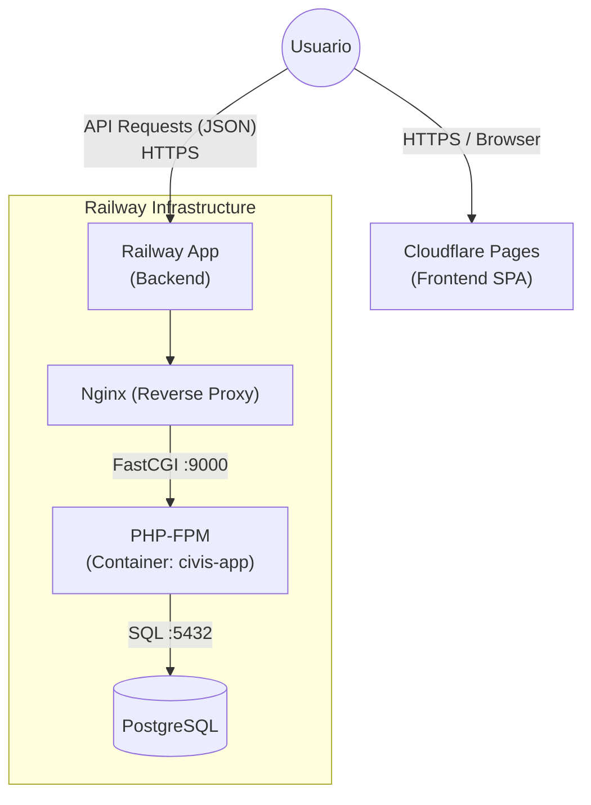
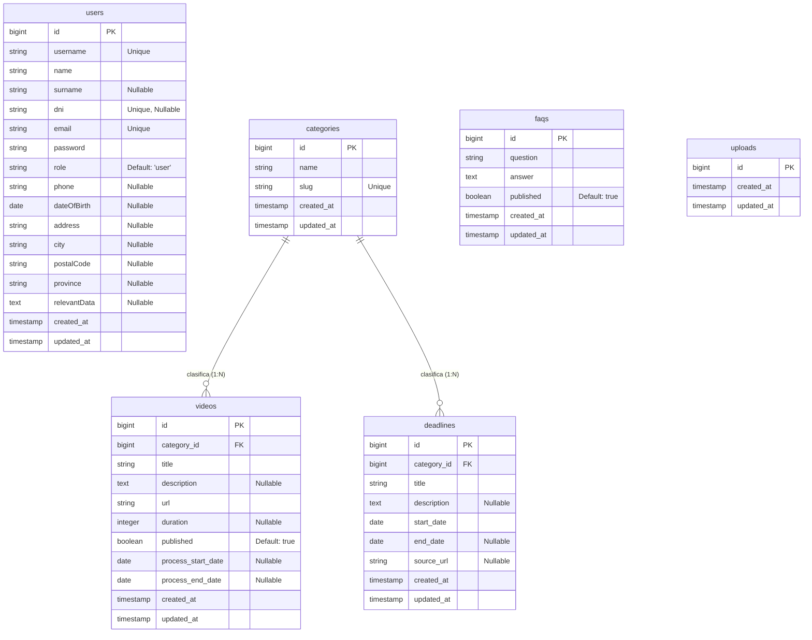

# Hito 1: Documentación Técnica - Proyecto CIVIS

**Autores:**
*   Máximo Casado Giner
*   Alejandro Torrez Muñoz
*   Ramón Manzano Alonso
*   Zhou Zhihui

## 1. Introducción

Este documento recoge la documentación técnica correspondiente al Hito 1 (Versión Beta – MVP) del proyecto CIVIS, desarrollado en el marco del Proyecto Intermodular del ciclo formativo de Desarrollo de Aplicaciones Web (DAW).

El objetivo de esta entrega es validar la viabilidad técnica del sistema, demostrando la correcta integración entre Frontend, Backend y Base de Datos, así como el funcionamiento del flujo principal de la aplicación.

En las siguientes secciones se detalla la arquitectura implementada, el modelo de datos definitivo, la documentación de la API y un informe de los principales problemas técnicos encontrados durante el desarrollo, junto con las soluciones aplicadas.

**Acceso al Repositorio:** [https://github.com/Atm0027/CIVIS](https://github.com/Atm0027/CIVIS)

---

## 2. Diagrama de Arquitectura Real

**Stack Tecnológico:**

| Capa | Tecnología | Descripción |
|------|------------|-------------|
| **Frontend Host** | Cloudflare Pages | Alojamiento de la SPA estática. |
| **Backend Host** | Railway | Despliegue de la API y Base de Datos. |
| **Backend** | Laravel 12 (PHP 8.4) | API RESTful y lógica de negocio. |
| **Frontend** | HTML5 + CSS3 + JS Vanilla | Interfaz de usuario ligera y responsiva. |
| **Base de Datos** | PostgreSQL 15 (Alpine) | Persistencia de datos relacional. |
| **Infraestructura** | Docker | Contenedores para Nginx, PHP y DB. |
| **Servidor Web** | Nginx 1.29 | Proxy inverso y servidor de estáticos. |
| **Autenticación** | Laravel Sanctum | Tokens JWT estatales para API. |


**Esquema de Comunicación:**




## 3. Modelo de Datos Definitivo (Diagrama E-R)

A continuación se muestra el esquema fiel a la base de datos implementada (incluyendo relaciones y campos actuales):



> **Nota:** La tabla `uploads` existe actualmente en la base de datos pero se encuentra en proceso de definición de campos.

---

## 4. Documentación de la API

Listado de endpoints verificados y funcionales.

**Base URL:** `http://localhost:8000/api`

### Especificación OpenAPI (Swagger)
A continuación se adjunta la definición formal de la API en formato YAML, lista para ser importada en herramientas como Swagger UI o Postman:

```yaml
openapi: 3.0.0
info:
  title: API CIVIS
  description: API para la gestión de trámites burocráticos y videos tutoriales.
  version: 1.0.0
servers:
  - url: http://localhost:8000/api
    description: Servidor de Desarrollo
paths:
  /auth/login:
    post:
      summary: Iniciar sesión
      tags: [Auth]
      requestBody:
        required: true
        content:
          application/json:
            schema:
              type: object
              properties:
                login:
                  type: string
                  example: admin@civis.local
                password:
                  type: string
                  example: admin1234
      responses:
        '200':
          description: Login exitoso
          content:
            application/json:
              schema:
                type: object
                properties:
                  token:
                    type: string
                  user:
                    $ref: '#/components/schemas/User'
  /videos:
    get:
      summary: Listar videos
      tags: [Videos]
      parameters:
        - in: query
          name: category
          schema:
            type: string
        - in: query
          name: q
          schema:
            type: string
      responses:
        '200':
          description: Lista paginada de videos
    post:
      summary: Crear video (Admin)
      tags: [Videos]
      security:
        - bearerAuth: []
      requestBody:
        required: true
        content:
          application/json:
            schema:
              $ref: '#/components/schemas/VideoInput'
      responses:
        '201':
          description: Video creado
  /deadlines:
    get:
      summary: Listar plazos
      tags: [Deadlines]
      responses:
        '200':
          description: Lista de plazos
  /calendar:
    get:
      summary: Obtener eventos del calendario
      description: Devuelve una lista unificada de Plazos y Videos con fechas.
      tags: [Calendar]
      responses:
        '200':
          description: Lista de eventos
  /uploads:
    get:
      summary: Listar archivos (Usuario)
      tags: [Uploads]
      security:
        - bearerAuth: []
      responses:
        '200':
          description: Lista de archivos
    post:
      summary: Subir archivo (Admin)
      tags: [Uploads]
      security:
        - bearerAuth: []
      requestBody:
        content:
          multipart/form-data:
            schema:
              type: object
              properties:
                file:
                  type: string
                  format: binary
      responses:
        '201':
          description: Archivo creado
  /uploads/{id}:
    delete:
      summary: Eliminar archivo (Admin)
      tags: [Uploads]
      security:
        - bearerAuth: []
      parameters:
        - in: path
          name: id
          required: true
          schema:
            type: integer
      responses:
        '200':
          description: Archivo eliminado
components:
  securitySchemes:
    bearerAuth:
      type: http
      scheme: bearer
  schemas:
    User:
      type: object
      properties:
        id:
          type: integer
        username:
          type: string
        email:
          type: string
        role:
          type: string
    VideoInput:
      type: object
      required: [title, url, category_id]
      properties:
        title:
          type: string
        url:
          type: string
        category_id:
          type: integer
        process_start_date:
          type: string
          format: date
        process_end_date:
          type: string
          format: date
```

### Endpoints Públicos

| Método | Endpoint | Descripción |
|--------|----------|-------------|
| `GET` | `/api/videos` | Listado paginado de videos. Permite filtros. |
| `GET` | `/api/videos/{id}` | Detalles de un video específico. |
| `GET` | `/api/videos/search` | Búsqueda de videos por título/descripción. |
| `GET` | `/api/categories` | Obtiene todas las categorías disponibles. |
| `GET` | `/api/deadlines` | Obtiene todos los plazos administrativos. |
| `GET` | `/api/deadlines/{id}` | Detalles de un plazo específico. |
| `GET` | `/api/calendar` | Calendario completo de eventos (Alias). |
| `GET` | `/api/calendar/upcoming` | Próximos eventos cercanos a vencer. |
| `GET` | `/api/faqs` | Listado de Preguntas Frecuentes. |
| `GET` | `/api/faqs/search` | Búsqueda dentro de las FAQs. |

### Endpoints de Autenticación

| Método | Endpoint | Descripción |
|--------|----------|-------------|
| `POST` | `/api/auth/register` | Crea una nueva cuenta de usuario. |
| `POST` | `/api/auth/login` | Inicia sesión y devuelve token Sanctum. |
| `GET` | `/api/auth/me` | Obtiene datos del usuario autenticado. |
| `POST` | `/api/auth/logout` | Cierra sesión (invalida token). |
| `GET` | `/api/auth/user/profile` | (Alias) Obtiene perfil de usuario. |
| `PUT` | `/api/auth/user/profile` | Actualiza datos del perfil. |
| `GET` | `/api/uploads` | Lista archivos subidos por el usuario. |

### Endpoints de Administración (Requiere Token Admin)

| Método | Endpoint | Descripción |
|--------|----------|-------------|
| `POST` | `/api/videos` | Registrar un nuevo video. |
| `PUT` | `/api/videos/{id}` | Actualizar datos de un video. |
| `DELETE` | `/api/videos/{id}` | Eliminar un video. |
| `DELETE` | `/api/videos/bulk` | Eliminación masiva de videos. |
| `POST` | `/api/categories` | Crear una nueva categoría. |
| `POST` | `/api/uploads` | Subir un nuevo archivo. |
| `DELETE` | `/api/uploads/{id}` | Eliminar un archivo. |

### Ejemplo de Uso (Creación de Recurso)

**POST** `/api/videos`
*Headers:* `Authorization: Bearer <token>`
*Body:*
```json
{
    "title": "Trámite de Empadronamiento",
    "description": "Guía oficial paso a paso.",
    "url": "https://youtube.com/watch?v=ejemplo",
    "category_id": 1,
    "process_start_date": "2026-03-01",
    "process_end_date": "2026-06-30"
}
```

---

## 5. Informe de Problemas

### 5.1. Obstáculos en el Desarrollo e Infraestructura Inicial

**Obstáculo Técnico Principal:** Integración Polimórfica en Calendario

**Descripción del Problema:**
El sistema gestionaba dos tipos de eventos temporales desconectados: "Plazos Administrativos" (`deadlines`) y "Trámites guiados" (`videos`). El calendario original solo mostraba la tabla `deadlines`, provocando que los usuarios perdieran visibilidad de cuándo iniciar los trámites que veían en la sección de videos, ya que estos carecían de fechas estructuradas en la base de datos.

**Solución Aplicada:**
1.  **Refactorización del Modelo (`Model Refactor`):** Se alteró la tabla `videos` (migración `2026_02_05`) para incluir `process_start_date` y `process_end_date`.
2.  **Unificación de API:** Se implementó lógica en el Backend para que los endpoints del calendario inyecten y normalicen ambos tipos de datos en una estructura JSON común.
3.  **Visualización Unificada:** El Frontend ahora consume esta fuente unificada y renderiza ambos tipos de eventos con distintivos visuales (colores diferentes para Plazos vs. Trámites), resolviendo la fragmentación de la información.

---

**Obstáculo Técnico:** Control de Acceso y Segregación de Roles

**Descripción del Problema:**
El sistema carecía de una distinción efectiva entre tipos de usuarios, permitiendo potencialmente que cualquier usuario autenticado accediera a funcionalidades críticas (como la creación de videos o gestión de categorías) si conocía las rutas de la API. La falta de segregación de roles al inicio del desarrollo impedía crear interfaces personalizadas y seguras para los administradores.

**Solución Aplicada:**
1.  **Migración de Esquema (Schema Migration):** Se añadió el campo `role` a la tabla `users` (migración `2026_01_15_125051`) para establecer permisos explícitos (`user` vs `admin`).
2.  **Protección Middleware (Middleware Security):** Se desarrolló el middleware `IsAdmin` para interceptar y validar peticiones a rutas sensibles, rechazando accesos no autorizados con un código 403.
3.  **Seguridad por Rutas:** Se agruparon los endpoints administrativos (POST/PUT/DELETE en videos y categorías) bajo el middleware `auth:sanctum` y `admin` en `routes/api.php`.

---

**Obstáculo Técnico:** Inconsistencia en Despliegue Docker (Volúmenes Huérfanos)

**Descripción del Problema:**
Durante el desarrollo, se detectó que los cambios en el código (específicamente en la carga de vistas de videos) no se reflejaban en el navegador, o arrojaban errores inesperados de "archivo no encontrado". Este comportamiento peculiar fue identificado y diagnosticado gracias a las alertas persistentes en el navegador de un miembro del equipo (Zhou), lo que fue clave para aislar el problema. La causa raíz fue la colisión entre el volumen de código actual montado en caliente (bind mount) y volúmenes anónimos antiguos ("huérfanos") que Docker mantenía de ejecuciones previas, los cuales servían una versión obsoleta de la estructura de carpetas `storage` o `public`.

**Solución Aplicada:**
1.  **Limpieza de Entorno:** Se ejecutó una purga completa de los recursos del stack con `docker-compose down --volumes --remove-orphans`. Esto eliminó explícitamente cualquier volumen persistente no declarado que pudiera estar interfiriendo.
2.  **Reinicio Limpio:** Se levantaron los servicios forzando la recreación de contenedores (`docker-compose up -d --build --force-recreate`), asegurando que el mapeo `./:/var/www/app` fuera la única fuente de verdad para el código aplicación.

---

**Obstáculo Técnico:** Desalineación de Identificadores en Fusión Front/Back

**Descripción del Problema:**
Al integrar los repositorios de Frontend y Backend, surgieron fallos masivos de funcionalidad. El Frontend realizaba llamadas a elementos del DOM y propiedades de la API utilizando identificadores (IDs y nombres de variables) que no existían o habían sido renombrados en la última versión del Backend/HTML. Esta desincronización provocó que scripts críticos fallaran silenciosamente o nulificaran la interacción del usuario.

**Solución Aplicada:**
1.  **Auditoría y Renombrado:** Se realizó una revisión exhaustiva de los archivos JavaScript y las vistas Blade/HTML para estandarizar la nomenclatura. Se renombraron selectores e identificadores para garantizar una coincidencia exacta entre la lógica del cliente y la estructura del servidor.
2.  **Limpieza de Código:** Se eliminaron archivos obsoletos y referencias a IDs antiguos que ya no tenían función en la nueva arquitectura, reduciendo la deuda técnica y previniendo futuros conflictos de nombres.

---

**Obstáculo Externo:** Interrupción Crítica del Entorno de Despliegue

**Descripción del Problema:**
Durante los últimos días críticos de la entrega del Hito 1, el equipo enfrentó un bloqueo inesperado debido a causas de fuerza mayor. El técnico encargado del despliegue (Zhou) sufrió un incidente de seguridad personal en su domicilio (ataque por parte de un vecino), lo cual impidió el acceso y mantenimiento de la infraestructura local que se estaba utilizando. Aunque se desconocen las motivaciones exactas y el alcance total de las secuelas, este evento detuvo por completo el avance del despliegue en el entorno original.

**Solución Aplicada:**
1.  **Migración a Cloudflare:** Ante la imposibilidad de operar el entorno local afectado, se tomó la decisión de emergencia de "subir" y desplegar la infraestructura a través de Cloudflare. Esto permitió desacoplar la disponibilidad del proyecto de la situación física del técnico, restableciendo el servicio y asegurando la entrega a tiempo bajo una nueva arquitectura en la nube.

---

### 5.2. Desafíos Técnicos del Despliegue en Producción (Cloudflare & Railway)

Tras la migración de emergencia, el equipo tuvo que enfrentarse a una serie de errores críticos de infraestructura derivados de la separación de entornos (Frontend en Cloudflare y Backend en Railway).

*   **Error 502 Bad Gateway (Comunicación Nginx / PHP-FPM):**
    *   **Problema:** El servidor Nginx no lograba conectar con el backend PHP debido a fallos de resolución en la red interna del contenedor (TCP/IP).
    *   **Solución:** Se sustituyó la conexión por red por Sockets de Dominio Unix (`/var/run/php/php-fpm.sock`). Se inyectó un script de diagnóstico ("El Chivato") para detectar fallos de permisos y se forzó la propiedad del socket al usuario `www-data` en el Dockerfile para garantizar la comunicación.

*   **Fallo de Resolución DNS en Base de Datos:**
    *   **Problema:** El backend no lograba localizar el host interno de PostgreSQL en Railway, devolviendo errores de traducción de nombre.
    *   **Solución:** Se configuró una Conexión Pública mediante TCP Proxy, ajustando el host y el puerto externo específico proporcionado por el proveedor para asegurar la persistencia de datos.

*   **Gestión Dinámica de Variables de Entorno (Error 405):**
    *   **Problema:** El Frontend en Cloudflare no detectaba la URL de la API, intentando realizar peticiones a rutas locales inexistentes.
    *   **Solución:** Se modificó el flujo de construcción (build command) para generar dinámicamente el archivo `config.env.js` en cada despliegue, inyectando la `API_BASE_URL` directamente en el navegador.

*   **Sincronización de Puertos y Errores de CORS:**
    *   **Problema:** Railway esperaba tráfico en el puerto 8000, pero el contenedor estaba configurado internamente para el 9000, lo que provocaba bloqueos de seguridad y caídas del servicio.
    *   **Solución:** Se forzó a Laravel a escuchar en el puerto esperado mediante el comando `php artisan serve --host=0.0.0.0 --port=8000`, sincronizando el flujo de red y eliminando los bloqueos de CORS.

**Estado Final:**
Con estas intervenciones de ingeniería de sistemas, la plataforma CIVIS se encuentra 100% operativa, con el Frontend conectado exitosamente a la API y la base de datos migrada y estable.
