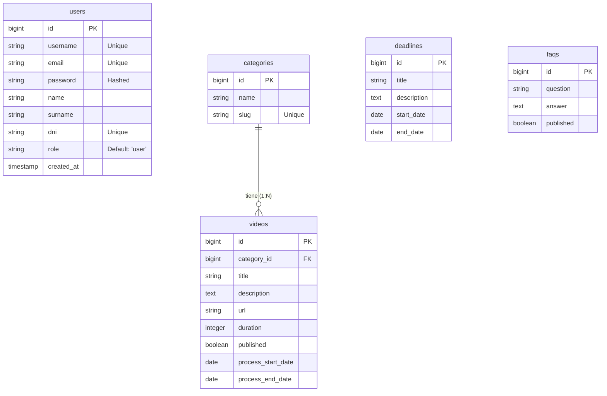

# Hito 1: Documentación Técnica - Grupo CIVIS

## 1. Diagrama de Arquitectura Real

**Stack Tecnológico:**

| Capa | Tecnología | Descripción |
|------|------------|-------------|
| **Backend** | Laravel 11 + PHP 8.2 | API RESTful y lógica de negocio. |
| **Frontend** | HTML5 + CSS3 + JS Vanilla | Interfaz de usuario ligera y responsiva. |
| **Base de Datos** | PostgreSQL 15 | Persistencia de datos relacional. |
| **Infraestructura** | Docker | Contenedores para Nginx, PHP-FPM y DB. |
| **Autenticación** | Laravel Sanctum | Tokens JWT para seguridad en API. |

**Esquema de Comunicación:**

```mermaid
graph TD
    User((Usuario)) -- HTTP/HTTPS --> Nginx[Nginx Proxy]
    Nginx -- Proxy Pass --> PHP[PHP-FPM (Laravel)]
    PHP -- SQL Query --> DB[(PostgreSQL)]
    PHP -- JSON Response --> Nginx
    Nginx -- JSON Response --> User
```

---

## 2. Modelo de Datos Definitivo (Diagrama E-R)

A continuación se muestra el esquema actual de la base de datos implementada:



---

## 3. Documentación de la API

La API sigue el estándar REST y utiliza respuestas en formato JSON.

**Base URL:** `http://localhost:8000/api`

### Resumen de Endpoints Funcionales

| Método | Endpoint | Descripción | Auth |
|--------|----------|-------------|------|
| `POST` | `/api/auth/register` | Registro de nuevo usuario | No |
| `POST` | `/api/auth/login` | Inicio de sesión (Email/User + Pass) | No |
| `GET` | `/api/videos` | Listado paginado de videos/trámites | No |
| `GET` | `/api/videos/{id}` | Detalle de un trámite específico | No |
| `GET` | `/api/deadlines` | Listado de plazos del calendario | No |
| `GET` | `/api/categories` | Listado de categorías | No |
| `POST` | `/api/videos` | Crear nuevo video (Admin) | Sí |

### Ejemplos de Uso

**1. Obtener listado de videos (GET)**

_Request:_
`GET /api/videos`

_Response (200 OK):_
```json
{
    "data": [
        {
            "id": 1,
            "title": "Cómo solicitar una beca",
            "url": "https://www.youtube.com/watch?v=video1",
            "category": { "id": 1, "name": "Estudios" }
        }
    ],
    "total": 10
}
```

**2. Crear una reserva / trámite (POST)**
*(Para este hito, el equivalente funcional es la creación de videos por el admin)*

_Request:_
`POST /api/videos`
`Authorization: Bearer <token_admin>`
```json
{
    "title": "Nuevo Trámite NIE",
    "url": "https://youtube.com/...",
    "category_id": 2,
    "process_start_date": "2026-03-01"
}
```

---

## 4. Informe de Problemas

**Obstáculo Técnico:** Integración de fechas de inicio/fin de trámites (Videos) en la vista de Calendario.

**Descripción:**
Inicialmente, los "Videos" y los "Plazos" (Deadlines) eran entidades totalmente separadas. Esto causaba que el Calendario solo mostrara plazos genéricos y no las fechas específicas asociadas a los trámites visuales (Videos), lo cual confundía al usuario sobre cuándo empezar un trámite visto en la videoteca.

**Solución Aplicada:**
1.  **Refactorización de Base de Datos:** Se añadieron los campos `process_start_date` y `process_end_date` a la tabla `videos`.
2.  **Unificación en Backend:** Se creó un endpoint unificado o lógica en el controlador para que la vista de Calendario pudiera consumir tanto `Deadlines` como `Videos` con fechas, tratándolos como "eventos" polimórficos en la interfaz.
3.  **Interfaz:** Se actualizó el componente de Calendario para renderizar ambos tipos de eventos con colores distintivos, permitiendo una visión integral de la burocracia.
