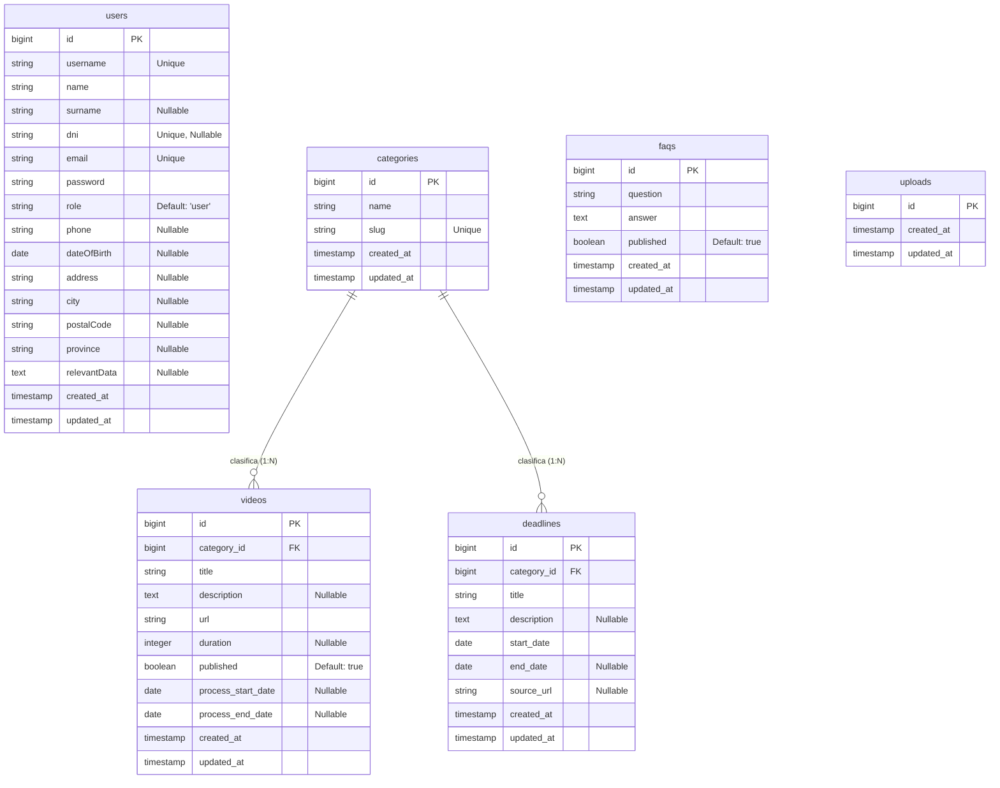

# Hito 1: Documentación Técnica - Grupo CIVIS

## 1. Diagrama de Arquitectura Real

**Stack Tecnológico:**

| Capa | Tecnología | Descripción |
|------|------------|-------------|
| **Backend** | Laravel 11 (PHP 8.2) | API RESTful y lógica de negocio. |
| **Frontend** | HTML5 + CSS3 + JS Vanilla | Interfaz de usuario ligera y responsiva. |
| **Base de Datos** | PostgreSQL 15 (Alpine) | Persistencia de datos relacional. |
| **Infraestructura** | Docker | Contenedores para Nginx, PHP y DB. |
| **Servidor Web** | Nginx 1.29 | Proxy inverso y servidor de estáticos. |
| **Autenticación** | Laravel Sanctum | Tokens JWT estatales para API. |

**Esquema de Comunicación:**

```mermaid
graph TD
    User((Usuario)) -- HTTP/HTTPS (Port 80) --> Nginx[Nginx Proxy]
    Nginx -- Proxy Pass --> PHP[PHP-FPM (Container: civis-app)]
    PHP -- SQL (Port 5432) --> DB[(PostgreSQL)]
    PHP -- JSON Response --> Nginx
    Nginx -- JSON Response --> User
```

---

## 2. Modelo de Datos Definitivo (Diagrama E-R)

A continuación se muestra el esquema fiel a la base de datos implementada (incluyendo relaciones y campos actuales):



> **Nota:** La tabla `uploads` existe actualmente en la base de datos pero se encuentra en proceso de definición de campos.

---

## 3. Documentación de la API

Listado de endpoints verificados y funcionales.

**Base URL:** `http://localhost:8000/api`

### Especificación OpenAPI (Swagger)
A continuación se adjunta la definición formal de la API en formato YAML, lista para ser importada en herramientas como Swagger UI o Postman:

```yaml
openapi: 3.0.0
info:
  title: API CIVIS
  description: API para la gestión de trámites burocráticos y videos tutoriales.
  version: 1.0.0
servers:
  - url: http://localhost:8000/api
    description: Servidor de Desarrollo
paths:
  /auth/login:
    post:
      summary: Iniciar sesión
      tags: [Auth]
      requestBody:
        required: true
        content:
          application/json:
            schema:
              type: object
              properties:
                login:
                  type: string
                  example: admin@civis.local
                password:
                  type: string
                  example: admin1234
      responses:
        '200':
          description: Login exitoso
          content:
            application/json:
              schema:
                type: object
                properties:
                  token:
                    type: string
                  user:
                    $ref: '#/components/schemas/User'
  /videos:
    get:
      summary: Listar videos
      tags: [Videos]
      parameters:
        - in: query
          name: category
          schema:
            type: string
        - in: query
          name: q
          schema:
            type: string
      responses:
        '200':
          description: Lista paginada de videos
    post:
      summary: Crear video (Admin)
      tags: [Videos]
      security:
        - bearerAuth: []
      requestBody:
        required: true
        content:
          application/json:
            schema:
              $ref: '#/components/schemas/VideoInput'
      responses:
        '201':
          description: Video creado
  /deadlines:
    get:
      summary: Listar plazos
      tags: [Deadlines]
      responses:
        '200':
          description: Lista de plazos
  /calendar:
    get:
      summary: Obtener eventos del calendario
      description: Devuelve una lista unificada de Plazos y Videos con fechas.
      tags: [Calendar]
      responses:
        '200':
          description: Lista de eventos
components:
  securitySchemes:
    bearerAuth:
      type: http
      scheme: bearer
  schemas:
    User:
      type: object
      properties:
        id:
          type: integer
        username:
          type: string
        email:
          type: string
        role:
          type: string
    VideoInput:
      type: object
      required: [title, url, category_id]
      properties:
        title:
          type: string
        url:
          type: string
        category_id:
          type: integer
        process_start_date:
          type: string
          format: date
        process_end_date:
          type: string
          format: date
```

### Endpoints Públicos

| Método | Endpoint | Descripción |
|--------|----------|-------------|
| `GET` | `/api/videos` | Listado paginado de videos. Permite filtros. |
| `GET` | `/api/videos/{id}` | Detalles de un video específico. |
| `GET` | `/api/videos/search` | Búsqueda de videos por título/descripción. |
| `GET` | `/api/categories` | Obtiene todas las categorías disponibles. |
| `GET` | `/api/deadlines` | Obtiene todos los plazos administrativos. |
| `GET` | `/api/deadlines/{id}` | Detalles de un plazo específico. |
| `GET` | `/api/calendar` | Calendario completo de eventos (Alias). |
| `GET` | `/api/calendar/upcoming` | Próximos eventos cercanos a vencer. |
| `GET` | `/api/faqs` | Listado de Preguntas Frecuentes. |
| `GET` | `/api/faqs/search` | Búsqueda dentro de las FAQs. |

### Endpoints de Autenticación

| Método | Endpoint | Descripción |
|--------|----------|-------------|
| `POST` | `/api/auth/register` | Crea una nueva cuenta de usuario. |
| `POST` | `/api/auth/login` | Inicia sesión y devuelve token Sanctum. |
| `GET` | `/api/auth/me` | Obtiene datos del usuario autenticado. |
| `POST` | `/api/auth/logout` | Cierra sesión (invalida token). |
| `GET` | `/api/auth/user/profile` | (Alias) Obtiene perfil de usuario. |
| `PUT` | `/api/auth/user/profile` | Actualiza datos del perfil. |

### Endpoints de Administración (Requiere Token Admin)

| Método | Endpoint | Descripción |
|--------|----------|-------------|
| `POST` | `/api/videos` | Registrar un nuevo video. |
| `PUT` | `/api/videos/{id}` | Actualizar datos de un video. |
| `DELETE` | `/api/videos/{id}` | Eliminar un video. |
| `DELETE` | `/api/videos/bulk` | Eliminación masiva de videos. |
| `POST` | `/api/categories` | Crear una nueva categoría. |

### Ejemplo de Uso (Creación de Recurso)

**POST** `/api/videos`
*Headers:* `Authorization: Bearer <token>`
*Body:*
```json
{
    "title": "Trámite de Empadronamiento",
    "description": "Guía oficial paso a paso.",
    "url": "https://youtube.com/watch?v=ejemplo",
    "category_id": 1,
    "process_start_date": "2026-03-01",
    "process_end_date": "2026-06-30"
}
```

---

## 4. Informe de Problemas

**Obstáculo Técnico Principal:** Integración Polimórfica en Calendario

**Descripción del Problema:**
El sistema gestionaba dos tipos de eventos temporales desconectados: "Plazos Administrativos" (`deadlines`) y "Trámites guiados" (`videos`). El calendario original solo mostraba la tabla `deadlines`, provocando que los usuarios perdieran visibilidad de cuándo iniciar los trámites que veían en la sección de videos, ya que estos carecían de fechas estructuradas en la base de datos.

**Solución Aplicada:**
1.  **Refactorización del Modelo (`Model Refactor`):** Se alteró la tabla `videos` (migración `2026_02_05`) para incluir `process_start_date` y `process_end_date`.
2.  **Unificación de API:** Se implementó lógica en el Backend para que los endpoints del calendario inyecten y normalicen ambos tipos de datos en una estructura JSON común.
3.  **Visualización Unificada:** El Frontend ahora consume esta fuente unificada y renderiza ambos tipos de eventos con distintivos visuales (colores diferentes para Plazos vs. Trámites), resolviendo la fragmentación de la información.
